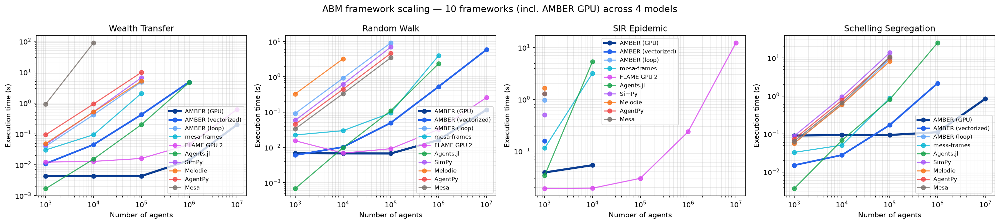

# AMBER (Agent-based Modeling with Blazingly Efficient Records)

[](https://github.com/a11to1n3/AMBER/actions/workflows/ci.yml)
[](https://codecov.io/gh/a11to1n3/AMBER)
[](https://www.python.org/downloads/release/python-390/)
[](https://pypi.org/project/ambr/)
[](https://opensource.org/licenses/BSD-3-Clause)

AMBER is a Python framework for agent-based modeling that uses Polars for efficient data handling and analysis. AMBER provides a clean, robust API for creating parallel, high-performance simulations in Python.

## 🚀 Performance

AMBER stores the entire population as a columnar Polars DataFrame and
exposes a vectorized view API (`agents.where(...)`, `agents.at[ids]`,
`scatter_add`) that compiles per-step updates down to a handful of
Polars expressions — regardless of population size.

**Benchmark against six other representative ABM/simulation frameworks
— 5000 agents, 50 executed steps, Python 3.12, Julia 1.12.3, Apple Silicon.**
All numbers are seeded wall-clock timings, averaged over 10 runs
(slowest trimmed). Every framework is **checked against output
invariants** (wealth conservation, boundary clamping, S+I+R population
conservation) before timing — see
[`benchmarks/correctness_check.py`](benchmarks/correctness_check.py).
Reproducer: [`benchmarks/run_all_frameworks.py`](benchmarks/run_all_frameworks.py).

| Framework | Language | Arch. | Wealth Transfer | Random Walk | SIR Epidemic |
|---|---|---|---:|---:|---:|
| **AMBER (vectorized)** | Python | Columnar (Polars) | 20 ms | 4.8 ms | **497 ms** |
| Agents.jl | Julia | Object | **7.2 ms** | **1.6 ms** | 813 ms |
| AMBER (loop) | Python | Object | 169 ms | 332 ms | 9.53 s |
| Mesa | Python | Object | 22.61 s | 131 ms | 16.63 s |
| AgentPy | Python | Object | 266 ms | 141 ms | 10.98 s |
| SimPy | Python | Event loop | 216 ms | 254 ms | 4.67 s |
| Melodie | Python | Hybrid | 177 ms | 1.03 s | 20.09 s |

**AMBER (vectorized) is the fastest Python-hosted framework on every
headline model at 5000 agents**. The headline SIR row is schedule-mixed;
use it as workload-class timing, not as an equivalent-trajectory
AMBER-over-Julia claim. Against Agents.jl, AMBER trails the Julia
implementation on wealth transfer and random walk, where per-step work is
small enough that Julia's compiled dispatch has less fixed overhead.


See [`benchmarks/README.md`](benchmarks/README.md) for the full table at
500 / 1000 / 5000 agents, speedup ratios, a per-model correctness audit,
and the documented SIR update-semantics caveat.

### Scaling to 10M agents with the GPU backend

The 0.4 GPU backend changes the story at large N. This sweep covers **1k → 10M
agents across 10 frameworks and four models** — adding **AMBER (GPU)** and a
**Schelling segregation** workload (NVIDIA RTX 3090 for the GPU series):



- **AMBER (GPU) reaches 10M agents on all four models** while CPU frameworks blow
  up. Wealth transfer: ~14 ms at 1M (≈330× the fastest CPU framework), 199 ms at
  10M (**3.1× faster than FLAME GPU 2**). Schelling: the **only** framework to
  reach 10M (847 ms; 19× AMBER-vectorized and 225× Agents.jl at 1M). SIR: 5.98 s
  at 10M (**~2× faster than FLAME GPU 2**), via an O(N) spatial-binning kernel.
- **It's a large-N win, not a small-N one.** A ~90 ms fixed device cost means
  AMBER (GPU) only leads at scale: below ~100k–1M, AMBER (vectorized) or Agents.jl
  are faster, and on SIR FLAME GPU 2 wins at 1k–10k before AMBER overtakes it from
  100k up. (FLAME GPU 2 implements no Schelling model, so it is absent from that
  panel.)

Regenerate with `python benchmarks/plot_scaling_with_gpu_schelling.py`.

## 🚀 Quick Start

AMBER supports an **AgentPy-shaped OOP lane** and a **vectorized lane** on the
same model. Start with whichever feels natural.

**AgentPy-shaped (method broadcast, `AgentList`):**

```python
import ambr as am

class WealthAgent(am.Agent):
    def setup(self):
        self.wealth = 1
    def transfer(self):
        if self.wealth > 0:
            other = self.model.agents.by_id(self.model.agents.random())
            other.wealth += 1
            self.wealth -= 1

class WealthModel(am.Model):
    def setup(self):
        self.agents = am.AgentList(self, self.p.n, WealthAgent)
    def step(self):
        self.agents.transfer()
    def update(self):
        self.record_model('total', int(self.agents.wealth.sum()))

results = WealthModel({'n': 50, 'steps': 20, 'seed': 1}).run()
print(results.model)      # also results['model']
print(results.agents.head())
```

**Vectorized (columnar; best at large N):**

```python
import ambr as am

class WealthModel(am.Model):
    model_reporters = {'total_wealth': lambda m: int(m.agents.wealth.sum())}

    def setup(self):
        self.add_agents(100, wealth=self.rng.integers(1, 10, size=100))

    def step(self):
        donors = self.agents.where(self.agents.wealth > 0)
        donors.wealth -= 1
        recipients = self.rng.choice(self.agents.ids.to_numpy(), size=len(donors))
        self.agents.at[recipients].scatter_add(wealth=1)

results = WealthModel({'steps': 100, 'seed': 42}).run()
print(results.model.tail(5))
print(results.agents.head(10))
```

Coming from AgentPy? See [`docs/from_agentpy.rst`](docs/from_agentpy.rst).

**Going faster / GPU** — no magic switch; pick a lane (see
[`docs/going_faster.rst`](docs/going_faster.rst)):

```python
import ambr as am
am.print_status()                 # GPU? which lane?
print(am.recommend(1_000_000))  # one-line suggestion

# Easiest GPU/CPU array model (CuPy if available, else NumPy):
class Drift(am.ArrayKernelModel):
    def init_state(self, xp, n, rng, p):
        return {"x": rng.random(n, dtype=xp.float32)}
    def step_state(self, xp, state, rng, p):
        state["x"] = state["x"] + 0.01
        return state
    def metrics(self, xp, state):
        return {"mean_x": float(am.to_host(state["x"].mean()))}

print(Drift({"n": 100_000, "steps": 20}).run().info)
```

`self.rng` is the canonical seeded RNG (a NumPy `Generator`); `self.random` is
the stdlib one. Both are seeded from the `seed` parameter. Progress printing is
off by default (`show_progress=True` to re-enable).

> **New in 0.4:** a runtime [snapshot-view contract](#-snapshot-view-contract)
> checker, a [GPU backend + batched calibration](#-gpu-backend--batched-calibration),
> one [canonical verb per task](#-canonical-api-04) (legacy spellings still work),
> declarative `model_reporters`, and a typed `params` schema. See the
> [changelog](CHANGELOG.md).
>
> **New in 0.3.0:** Setting ``agent.wealth = 5`` on a Python Agent
> automatically syncs to the DataFrame. You can freely mix OOP-style
> and vectorized access without desync.

## ⚡ Vectorized View API

The view API compiles per-step updates to a handful of Polars expressions
— regardless of population size:

```python
def step(self):
    # Bulk columnar reads/writes over the entire population
    self.agents.x = self.agents.x + self.rng.uniform(-1, 1, len(self.agents))

    # Filtered writes: only agents matching a condition
    infected = self.agents.where(self.agents.status == 1)
    infected.infection_time += 1

    # scatter_add: flow-of-resources with duplicate-id safety
    self.agents.at[[1, 1, 3]].scatter_add(wealth=1)  # agent 1 gets +2, agent 3 gets +1
```

## 🧭 Canonical API (0.4)

AMBER 0.4 settles on one obvious verb per task. The legacy spellings still work
(they emit a `DeprecationWarning` and are scheduled for removal in **1.0**); set
`AMBER_SUPPRESS_DEPRECATIONS=1` to silence them in benchmark / reproducibility runs.
Batch performance comes from these verbs (columnar writes), not from extra public
`batch_*` helpers.

| Task | Canonical | Legacy (deprecated → 1.0) |
|------|-----------|---------------------------|
| NumPy RNG | `self.rng` | `self.nprandom` |
| Record a model metric | `model_reporters = {...}` or `record_model(k, v)` | `record(k, v)` |
| Filter agents | `agents.where(expr)` / `agents[mask]` / `agents.at[ids]` | `agents.select(...)` |
| Per-agent write | `agent.col = v` | `agent.record(...)`, `agent.update_data(...)`, `update_agent_data` |
| Bulk / multi-column write | `agents.set(**cols)` or `view.col = …` | `agents.record` / `update_data`, `batch_update_agents`, `Population.batch_*` |
| Accumulate (duplicate ids) | `agents.at[ids].scatter_add(...)` | double ordinary writes in one step |
| Array kernels | `agents.borrow` / `agents.commit` (or `TensorLane`) | hand-maintained parallel NumPy buffers |
| Read agent objects | iterate `model.agents`, `agents.by_id(i)` | `agents.agents`, `agents.agent_ids` |
| Bulk numpy round-trip | `agents.numpy(...)` + `agents.set(...)` | `.to_numpy()` + per-column assign only |
| Typed parameters | `params = {'n': (int, 200)}`, then `self.p.n` | `int(self.p.get('n', 200))` |
| Grid wrap | `GridEnvironment(torus=True)` | `wrap=` / `.wrap` |
| Agent table assign | view / `_set_frame` | `population.data = ...` (setter warns) |

`update()` is a **pure hook** — overriding it no longer requires
`super().update()`. Declare `model_reporters` / `agent_reporters` for
declarative metrics, and set `record_initial = True` to capture a `t=0` row.

## 🔒 Snapshot-view contract

The columnar fast path is only valid for rules that preserve the intended update
schedule. AMBER turns that from a silent assumption into a checkable, per-step
artifact — run with a contract mode and inspect the certificates:

```python
results = model.run(steps=100, contract="check")   # "off" | "check" | "warn" | "raise"
for cert in results["contract"]:
    if not cert.ok:
        print(cert.step, cert.violations)
```

`check` records a `ContractCertificate` per step; `warn` also emits a warning per
violation; `raise` stops on the first error. Mode `off` (default) adds zero overhead.

The monitor watches **two write paths** (and combinations):

* **Buffered (OOP)** — `agent.col = …` / queued cell writes  
* **Lane / view** — `agents.col = …`, `agents.set(...)`, `borrow`/`commit`  
* **Cross-path** — same column via both OOP and view in one step → `cross_path_write`  

`scatter_add` is the sanctioned multi-write reducer (not treated as a conflicting
ordinary commit). Prefer those APIs over assigning `population.data` directly.

## 🎮 GPU backend & batched calibration

The same columnar contract runs on a CuPy array backend, and the *ensemble* axis
(`B` simulations × `N` agents) batches into one device pass — the natural fit for
calibration, where you evaluate thousands of small replicate runs:

```python
from ambr.gpu_ensemble import GPUEnsembleRunner, BatchedWellMixedSIR, smac_batch_calibrate

# Evaluate B parameter sets in one (B, N) GPU pass
runner = GPUEnsembleRunner(BatchedWellMixedSIR())
traj = runner.run(n_agents=100_000, steps=60,
                  params={"beta": betas, "gamma": gammas, "i0_frac": i0})  # -> {metric: (B, steps)}

# SMAC ask -> one batched GPU evaluation -> tell
best, history = smac_batch_calibrate(BatchedWellMixedSIR(), bounds, loss_fn,
                                     n_agents=100_000, steps=60)
```

`ambr.gpu` provides the array-module abstraction (`get_array_module`, `to_device`,
`to_host`) and falls back to NumPy when CuPy is unavailable.

## 🔬 Optimization

AMBER includes powerful optimization capabilities for parameter tuning:

```python
from ambr.optimization import ParameterSpace, grid_search

# Define parameter space
parameter_space = ParameterSpace({
    'agents': [10, 50, 100],
    'initial_value': [1, 5, 10],
    'steps': 100
})

# Run optimization
results = grid_search(MyModel, parameter_space, 'some_metric')
best_params = results[0]['parameters']
```

Beyond `grid_search`, AMBER ships `random_search`, `bayesian_optimization`
(SMAC Gaussian-process), and `SMACOptimizer` (random-forest surrogate) — plus the
GPU batched ensemble above for derivative-free calibration at scale.

## 📦 Installation

```bash
pip install ambr
```

## 🏗️ Features

- **Simple API**: Intuitive interface for agent-based modeling
- **High Performance**: Efficient data handling with Polars DataFrames
- **Snapshot-view contract**: runtime conformance checking that columnar updates preserve the intended schedule
- **GPU backend**: CuPy array backend + batched ensemble for parameter sweeps and calibration
- **Optimization**: grid / random / Bayesian (SMAC) search, plus GPU-batched calibration
- **Declarative reporting**: `model_reporters` / `agent_reporters` and a typed `params` schema
- **Environments**: Support for grid, network, and continuous space environments
- **Experiments**: Run multiple simulations with parameter sampling
- **Random Number Generation**: Reproducible simulations with controlled randomness

## 📚 Examples

Working examples are available in the `examples/` directory:

- **Wealth Transfer Model**: Economic inequality simulation
- **Virus Spread Model**: Epidemiological SIR model
- **Flocking Simulation**: Boids flocking behavior
- **Forest Fire Model**: Cellular automata fire spread
- **Network Simulations**: Graph-based agent interactions

## 📖 Documentation

- **Documentation**: https://ambr.readthedocs.io/
- **Paper**: https://arxiv.org/abs/2601.16292

## 📝 How to cite?

If you use AMBER in your research, please cite our paper:

```bibtex
@article{pham2026amber,
  title={AMBER: A Columnar Architecture for High-Performance Agent-Based Modeling in Python},
  author={Pham, Anh-Duy},
  journal={arXiv preprint arXiv:2601.16292},
  year={2026}
}
```

## 🤝 Contributing

We welcome contributions! Please see our contributing guidelines for more information.

## 📄 License

This project is licensed under the BSD 3-Clause License - see the [LICENSE](LICENSE) file for details.
