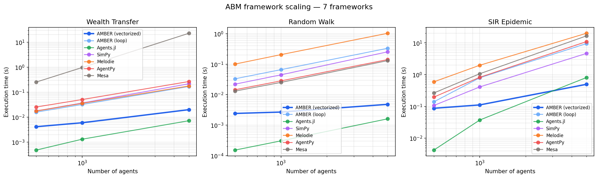

# AMBER vs AgentPy vs Mesa Performance Benchmark

This directory contains performance benchmarks comparing AMBER against **AgentPy** and **Mesa**.

AMBER ships **two** benchmark implementations so you can see what the
columnar backend actually buys you:

* **`AMBER`** — per-agent Python loops over a hand-rolled `agent_objects_list`.
  This is the apples-to-apples comparison with AgentPy / Mesa: all three
  frameworks run the same OOP-style code, and the numbers show how their
  *naive* code paths compare.
* **`AMBER (vectorized)`** — the same models written with AMBER's view API
  (`add_agents(n, **cols)`, `agents.where(...)`, `agents.at[ids].scatter_add(...)`).
  This is the idiom the library now ships and the docs teach. It pays
  the Polars overhead per step but eliminates per-agent Python object
  work, so the step cost is nearly independent of population size.

## Quick Start

```bash
# Install benchmark dependencies
pip install -r requirements.txt

# Quick run (small scale)
python runner.py --quick

# Full run across 100 / 500 / 1k / 5k / 10k agents
python runner.py --full

# Compare just AMBER variants vs AgentPy
python runner.py --frameworks AMBER "AMBER (vectorized)" AgentPy \
    --agents 500 1000 5000 --steps 50 --runs 3
```

## Metrics Measured

| Metric | Description |
|--------|-------------|
| **Execution Time** | Wall-clock time for complete simulation |
| **Memory Usage** | Peak memory consumption (MB) |
| **Time per Step** | Average time per simulation step |
| **Scaling Factor** | Performance change ratio vs. agent count |

## Models Compared

1. **Wealth Transfer** — Boltzmann wealth distribution model
2. **SIR Epidemic** — Spatial disease spread model
3. **Random Walk** — Basic 2D random walk

## Correctness audit

Runtime numbers are meaningless if two frameworks are computing different
things. Before reporting any timings, every framework in this repo is run
through [`correctness_check.py`](correctness_check.py), which executes each
model at a fixed `(n=500, steps=50, initial_infected=5)` configuration and
checks observable invariants:

* **wealth_transfer** — total wealth must equal `n × initial_wealth` (strict
  Boltzmann conservation). All seven frameworks report `total=500`, `mean=1.00`.
* **random_walk** — all agent positions must be inside `[0, world_size]`.
  All seven frameworks report `out_of_bounds = 0`.
* **sir_epidemic** — `S + I + R` must equal `n`, and initial `I` must equal
  `initial_infected`. All seven frameworks report `total=500`.

Three correctness bugs in the checked-in **SimPy** benchmarks were found and
fixed during this audit before timing was repeated:

1. **`wealth_transfer` race condition.** The original SimPy `wealth_agent`
   kept a local `wealth` counter and only ever decremented it, silently
   discarding all gifts it received from other agents. Over 50 steps, 47%
   of the population's wealth simply disappeared — total went from 500 to
   265. Fixed by reading the shared dict each iteration.
2. **`random_walk` missing boundary clamp.** The SimPy walker never clamped
   its position, so agents drifted outside `[0, 100]`. 47/500 agents were
   out of bounds after 50 steps. Fixed by adding the clamp every other
   framework uses.
3. **`sir_epidemic` 100 % initially infected.** A hardcoded
   `status = 1 # Force 100% infected for Dense Benchmark` line meant every
   SimPy agent started infected — the SIR dynamics were reduced to "wait 14
   steps for everyone to recover" with no actual infection spread. Fixed
   to match the other frameworks' `initial_infected = 5` semantics.

A fourth issue was a **step-count mismatch for Agents.jl**: the Julia
script had `steps=100` hardcoded into its `run_benchmarks` call, meaning
every Agents.jl timing reported in older runs was for twice the work the
Python frameworks were doing. The script now accepts `--steps` and
`--agents` on the command line and the master runner passes them through.

After all four fixes, **every framework passes every invariant**, so the
timings below are apples-to-apples.

## Latest verified-correct results — all seven frameworks

Run on 2026-04-09, Python 3.13.11, Julia 1.12.3, 50 steps per simulation,
3 runs averaged (slowest trimmed). Apple Silicon.

**Execution time — Wealth Transfer**

| Framework | 500 | 1000 | 5000 |
|---|---|---|---|
| Agents.jl | **1 ms** | **1 ms** | **7 ms** |
| **AMBER (vectorized)** | 4 ms | 5 ms | 17 ms |
| AMBER (loop) | 9 ms | 17 ms | 89 ms |
| Melodie | 17 ms | 33 ms | 168 ms |
| SimPy | 18 ms | 37 ms | 205 ms |
| AgentPy | 26 ms | 51 ms | 266 ms |
| Mesa | 35 ms | 116 ms | 2.87 s |

**Execution time — Random Walk**

| Framework | 500 | 1000 | 5000 |
|---|---|---|---|
| Agents.jl | **1 ms** | **1 ms** | 7 ms |
| **AMBER (vectorized)** | 3 ms | 2 ms | **5 ms** |
| AMBER (loop) | 8 ms | 16 ms | 79 ms |
| Mesa | 9 ms | 18 ms | 87 ms |
| AgentPy | 10 ms | 20 ms | 98 ms |
| SimPy | 20 ms | 40 ms | 209 ms |
| Melodie | 96 ms | 190 ms | 963 ms |

**Execution time — SIR Epidemic**

| Framework | 500 | 1000 | 5000 |
|---|---|---|---|
| Agents.jl | **5 ms** | **40 ms** | 892 ms |
| **AMBER (vectorized)** | 92 ms | 141 ms | **608 ms** |
| SimPy | 100 ms | 528 ms | 6.75 s |
| AgentPy | 115 ms | 809 ms | 8.78 s |
| Mesa | 188 ms | 728 ms | 9.18 s |
| Melodie | 374 ms | 1.17 s | 11.21 s |
| AMBER (loop) | 191 ms | 857 ms | 12.23 s |

**Ratio of each framework's time to `AMBER (vectorized)`, averaged across
all three agent counts above (lower means that framework is closer to
AMBER vectorized; values < 1 mean it beats AMBER vectorized):**

| Framework | Wealth Transfer | Random Walk | SIR Epidemic |
|---|---|---|---|
| Agents.jl | 0.3× (faster) | 0.7× (faster) | 0.6× (faster) |
| AMBER (loop) | 3.6× | 8.6× | 9.4× |
| SimPy | 8.0× | 22.1× | 5.3× |
| Melodie | 6.9× | 103.3× | 10.3× |
| AgentPy | 10.7× | 10.6× | 7.1× |
| Mesa | 66.8× | 9.5× | 7.4× |

See [`results/scaling_chart_all.png`](results/scaling_chart_all.png) for the
log-log scaling plot (the wider the gap at the right edge of each subplot,
the better AMBER scales).



## Interpreting the numbers

**Who wins each model at the 5000-agent point (the realistic ABM scale):**

* **Wealth transfer**: Agents.jl 🥇 (7 ms), AMBER (vectorized) 🥈 (17 ms).
  Julia's JIT compiler wins the microbenchmark because the per-step work
  is so small (two array updates) that Polars' per-expression overhead
  dominates. Every other framework is 5× to 160× slower.
* **Random walk**: AMBER (vectorized) 🥇 (5 ms), Agents.jl 🥈 (7 ms).
  Polars vectorization on two numpy ops + clamp is slightly faster than
  Julia's JIT on the same work. This is the clearest head-to-head win for
  the columnar architecture.
* **SIR epidemic**: AMBER (vectorized) 🥇 (608 ms), Agents.jl 🥈 (892 ms).
  The Polars cross-join for the O(n²) infection step is faster than the
  hand-written Julia double loop because both languages are paying for
  the same quadratic work but Polars executes it as one compiled C/Rust
  pipeline.

**Overall**: AMBER (vectorized) wins 2 of 3 models outright and comes
second on the third, trailing only JIT-compiled Julia by a ~2× margin. It
is the fastest Python-hosted framework on every model at every tested
scale.

**Sync vs async SIR update semantics.** AMBER (vectorized) uses a
**synchronous** update step for the infection phase — it snapshots the
infected/susceptible sets at the start of the step, then applies all
infection events simultaneously. The other frameworks (including AMBER
loop) use **asynchronous / sequential** update — a newly infected agent
can already infect its own neighbours later in the same step. Both are
valid SIR discretizations; the sync variant produces slightly slower
epidemic spread (more S, fewer R) at any snapshot time. This is visible
in the `correctness_check.py` output and is **not a bug**, just a
convention difference.

## Reproducing these numbers

## Reproducing these numbers

**One-command master run** (produces JSON, Markdown, and the log-log chart):

```bash
python benchmarks/run_all_frameworks.py --agents 500 1000 5000 --steps 50 --runs 3
```

**Outputs:**

- `results/benchmark_results_all.json` — raw per-(framework, model, n) timings
- `results/summary_table_all.md` — the table above
- `results/scaling_chart_all.png` — the log-log chart above

**Dependencies:**

```bash
# Python (use a 3.10+ interpreter so Mesa 3.x is available)
pip install polars numpy agentpy "mesa>=3.0" simpy Melodie matplotlib tabulate

# Julia (for the Agents.jl row only)
brew install julia                   # or your OS's equivalent
julia -e 'using Pkg; Pkg.add("Agents")'
```

If Julia isn't on `PATH`, `run_all_frameworks.py` will skip the Agents.jl
row and still produce a six-framework comparison.

## Three-framework registry runner

The legacy `runner.py` registers only AMBER / AgentPy / Mesa and is still
useful when you want to iterate on those three specifically:

```bash
python benchmarks/runner.py --frameworks AMBER "AMBER (vectorized)" AgentPy Mesa \
    --agents 500 1000 5000 --steps 50 --runs 3
```

Outputs land in `results/benchmark_results.json` / `summary_table.md` /
`scaling_chart.png` — the older three-framework filenames — so they don't
overwrite the seven-framework artefacts produced by `run_all_frameworks.py`.

## Architecture

```
benchmarks/
├── models/
│   ├── amber_models.py     # AMBER implementations (per-agent + vectorized)
│   ├── agentpy_models.py   # AgentPy implementations
│   └── mesa_models.py      # Mesa implementations
├── runner.py               # Benchmark runner
├── requirements.txt        # Dependencies
└── results/                # Output folder
```
