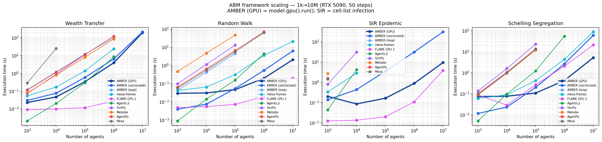

# AMBER benchmarks

Performance and correctness harnesses for AMBER and optional peer frameworks.
**Core install** (`pip install ambr`) does **not** pull multi-framework or GPU
stacks — those are optional for this directory.

## Lanes (what you are timing)

* **`AMBER` / loop** — per-agent Python OOP path (fair vs AgentPy / Mesa).
* **`AMBER (vectorized)`** — columnar view API (`add_agents`, `where`, `scatter_add`).
* **`AMBER (GPU)`** — same vectorized models via `model.gpu().run()` (needs CuPy + NVIDIA).
  Private kernel models in `models/amber_gpu_scale_models.py` are **benchmark
  internals**, not the public `ambr` API. Production SIR infection draws use a
  pair-keyed SplitMix64 counter tape (`global_seed`, step, pair ids); see
  `tests/test_sir_counter_tape.py`.

## Optional dependencies

| Goal | Install |
|------|---------|
| AMBER CPU only | `pip install ambr` (+ `requirements.txt` for older `runner.py` peers) |
| AMBER GPU | `pip install 'ambr[gpu]'` or `cupy` matching your CUDA |
| Multi-framework Python peers | Mesa, mesa-frames, AgentPy, Melodie, SimPy as needed |
| FLAME GPU 2 | `pip install --extra-index-url https://whl.flamegpu.com/whl/cuda130/ pyflamegpu` (or cuda120 wheel); CUDA NVRTC libs on `LD_LIBRARY_PATH` / preload |
| Agents.jl | Julia + `Agents.jl`; runner spawns a subprocess |

Missing optional software → that framework is **skipped**, not timed as zero.

## Missing cells (not zeros)

Large-N multi-framework runs may **OOM** (e.g. mesa-frames SIR ≥100k) or hit
per-run **budgets**. Do not impute missing cells as 0 s. Prefer JSON rows that
record a status, or document skips in the campaign notes.

## Headline README numbers

The package README cites
`results/benchmark_results_snapshot_correct_10run_10m.json`
(AMBER GPU vs FLAME at 10M, 10 runs, all samples retained). Schelling ratios
are setup-inclusive for the FLAME harness — exploratory, not pure kernel
speedup. Other charts under `results/` may use different protocols (trimmed
means, older stacks); check each file’s provenance.

## Quick Start

```bash
# Install benchmark dependencies (peers optional)
pip install -r requirements.txt

# Quick run (small scale)
python runner.py --quick

# Full run across 100 / 500 / 1k / 5k / 10k agents
python runner.py --full

# Compare just AMBER variants vs AgentPy
python runner.py --frameworks AMBER "AMBER (vectorized)" AgentPy \
    --agents 500 1000 5000 --steps 50 --runs 10

# Large-N multi-framework (optional peers; GPU host)
python run_all_frameworks.py --agents 10000000 --steps 50 --runs 10 \
    --frameworks "AMBER (GPU)" "FLAME GPU 2" --budget 1200
```

## Metrics Measured

| Metric | Description |
|--------|-------------|
| **Execution Time** | Wall-clock time for complete simulation |
| **Memory Usage** | Peak memory consumption (MB) |
| **Time per Step** | Average time per simulation step |
| **Scaling Factor** | Performance change ratio vs. agent count |

## Models Compared

1. **Wealth Transfer** — Boltzmann wealth distribution model
2. **SIR Epidemic** — Spatial disease spread model
3. **Random Walk** — Basic 2D random walk

## Correctness audit

Runtime numbers are meaningless if two frameworks are computing different
things. Before reporting any timings, every framework in this repo is run
through [`correctness_check.py`](correctness_check.py), which executes each
model at a fixed `(n=500, steps=50, initial_infected=5)` configuration and
checks observable invariants:

* **wealth_transfer** — total wealth must equal `n × initial_wealth` (strict
  Boltzmann conservation). All seven frameworks report `total=500`, `mean=1.00`.
* **random_walk** — all agent positions must be inside `[0, world_size]`.
  All seven frameworks report `out_of_bounds = 0`.
* **sir_epidemic** — `S + I + R` must equal `n`, and initial `I` must equal
  `initial_infected`. All seven frameworks report `total=500`.

Three correctness bugs in the checked-in **SimPy** benchmarks were found and
fixed during this audit before timing was repeated:

1. **`wealth_transfer` race condition.** The original SimPy `wealth_agent`
   kept a local `wealth` counter and only ever decremented it, silently
   discarding all gifts it received from other agents. Over 50 steps, 47%
   of the population's wealth simply disappeared — total went from 500 to
   265. Fixed by reading the shared dict each iteration.
2. **`random_walk` missing boundary clamp.** The SimPy walker never clamped
   its position, so agents drifted outside `[0, 100]`. 47/500 agents were
   out of bounds after 50 steps. Fixed by adding the clamp every other
   framework uses.
3. **`sir_epidemic` 100 % initially infected.** A hardcoded
   `status = 1 # Force 100% infected for Dense Benchmark` line meant every
   SimPy agent started infected — the SIR dynamics were reduced to "wait 14
   steps for everyone to recover" with no actual infection spread. Fixed
   to match the other frameworks' `initial_infected = 5` semantics.

A fourth issue was a **step-count mismatch for Agents.jl**: the Julia
script had `steps=100` hardcoded into its `run_benchmarks` call, meaning
every Agents.jl timing reported in older runs was for twice the work the
Python frameworks were doing. The script now accepts `--steps` and
`--agents` on the command line and the master runner passes them through.

A later audit also aligned the **random-walk and SIR movement kernel**:
SimPy, Melodie, and Agents.jl now use the same independent x/y displacement
as AMBER, AgentPy, and Mesa. Agents.jl now also uses the same run count and
slowest-sample trim protocol as the Python frameworks.

After these fixes, every framework passes the structural invariants used for
timing admission. The SIR benchmark still has a documented update-ordering
caveat: AMBER (vectorized) and Melodie use a synchronous infection phase,
while the other implementations use sequential/asynchronous infection. Treat
the SIR timings as a comparison of the same spatial epidemic workload class,
not as proof of identical stochastic trajectories.

## Published results — large-N multi-framework (1k→10M)

**One** checked-in performance plot and table. NVIDIA RTX 5090, 50 steps,
10 runs (trimmed mean). Ten frameworks. AMBER (GPU) uses the same view-API
models under an explicit benchmark evidence label followed by
`model.gpu().run()` (0.4.4+); the label records caller approval and is not a
runtime certificate.

- Chart: [`results/scaling_chart.png`](results/scaling_chart.png)
- Full per-model tables: [`results/summary_table.md`](results/summary_table.md)



**At 1M / 10M (where each framework still finishes):**

| Model | AMBER (GPU) | AMBER (vectorized) | FLAME GPU 2 | Next best CPU-scale peer |
|---|---:|---:|---:|---:|
| Wealth | 3.91 s / 193 s | 6.44 s / 214 s | **28 ms / 226 ms** | Agents.jl 8.53 s @ 1M |
| Random walk | 198 ms / 2.04 s | 531 ms / 6.23 s | **20 ms / 201 ms** | mesa-frames 3.55 s / 20.8 s |
| Schelling | **428 ms / 5.17 s** | 2.64 s / 59.8 s | 2.06 s / 20.8 s | mesa-frames 4.33 s / 86.9 s |
| SIR (cell-list) | 882 ms / **9.39 s** | 31.3 s / 308 s | **108 ms / 3.80 s** | — |

## Polars Lazy GPU probe (not product path)

`try_polars_gpu.py` is a **cautionary** experiment comparing Polars Lazy
`engine="gpu"` against AMBER's native `model.gpu()` path. It is **not**
AMBER's agent GPU runtime and is not used for published charts. Prefer
`step_vectorized` + `model.gpu().run()` for production models.

## Interpreting the numbers

* **Schelling:** AMBER (GPU) is the fastest measured row at 1M and 10M.
* **Wealth / random walk:** FLAME GPU 2 leads; AMBER (GPU) still leads other
  Python-hosted stacks that reach those scales. Light kernels pay GPU overhead.
* **SIR:** AMBER uses **cell-list** infection (O(N·K), `max_per_cell=64`).
  GPU 10M = 9.39 s (~33× vs vectorized 308 s); FLAME still leads at 3.80 s.
* Object OOP frameworks (Mesa, AgentPy, …) typically drop out above 100k–1M.

**Sync vs async SIR update semantics.** AMBER (vectorized) uses a
**synchronous** infection phase; several peers use sequential/async infection.
Both are valid discretizations; correctness checks population conservation
rather than identical trajectories. Use the split SIR runner below for
semantics-aligned evidence.

## Reproducing these numbers

**Large-N master run** (produces Markdown + chart; raw JSON is local-only):

```bash
python benchmarks/run_all_frameworks.py \
    --agents 1000 10000 100000 1000000 10000000 \
    --steps 50 --runs 10
# optional replot from an existing JSON:
python benchmarks/plot_scaling_with_gpu_schelling.py \
    --input path/to/benchmark_results.json \
    --output benchmarks/results/scaling_chart.png
```

**Outputs:**

- `results/*.json`, `results/*.log`, `results/*5090*` — machine-local
  (**gitignored**; never the published baseline)
- `results/summary_table.md` — full large-N tables (**checked in**)
- `results/scaling_chart.png` — the **only** published performance plot

**AMBER (GPU) (0.4.3+):** the main harness times the same vectorized models as
AMBER (vectorized) via `model.gpu().run()`. Do not keep or cite interim split
logs from before that change as current GPU numbers.

**Dependencies:**

```bash
# Python (use a 3.10+ interpreter so Mesa 3.x is available)
pip install polars numpy agentpy "mesa>=3.0" simpy Melodie matplotlib tabulate

# Julia (for the Agents.jl row only)
brew install julia                   # or your OS's equivalent
julia -e 'using Pkg; Pkg.add("Agents")'
```

If Julia isn't on `PATH`, `run_all_frameworks.py` will skip the Agents.jl
row and still produce a six-framework comparison.

## Semantics-aligned SIR and dynamic graph runners

The headline SIR benchmark intentionally preserves the checked-in framework
implementations, so it mixes synchronous, sequential, and event-scheduled SIR
conventions. The split runner below fixes initial positions, movement deltas,
and pair-level transmission draws, then reports sync and async rows separately:

```bash
python benchmarks/run_sir_schedule_variants.py --agents 500 1000 --steps 50 --runs 10 \
    --budget-skip-modes async_simpy_refactored \
    --budget-skip-reason "declared run-budget exclusion"
python benchmarks/run_sir_schedule_variants.py --agents 500 1000 5000 --steps 50 --runs 10 \
    --modes agentsjl_actual_source_sync agentsjl_actual_source_async --resume-existing
```

Outputs land in `results/sir_schedule_results.md` (and a local
`sir_schedule_results.json`, gitignored).

The dynamic graph runner adds a bounded-confidence opinion workload with a
deterministic sparse edge relation regenerated every step:

```bash
python benchmarks/run_dynamic_graph_variants.py --agents 500 1000 5000 \
    --seeds 42 77 123 --steps 20 --runs 5
```

Outputs land in `results/dynamic_graph_results.md` (and a local
`dynamic_graph_results.json`, gitignored).

## Three-framework registry runner

The legacy `runner.py` registers only AMBER / AgentPy / Mesa and is still
useful when you want to iterate on those three specifically:

```bash
python benchmarks/runner.py --frameworks AMBER "AMBER (vectorized)" AgentPy Mesa \
    --agents 500 1000 5000 --steps 50 --runs 10
```

Writes a local `benchmark_results.json` (gitignored). Prefer
`run_all_frameworks.py` for the published large-N artefacts
(`summary_table.md` / `scaling_chart.png`).

## Architecture

```
benchmarks/
├── models/
│   ├── amber_models.py     # AMBER implementations (per-agent + vectorized)
│   ├── agentpy_models.py   # AgentPy implementations
│   └── mesa_models.py      # Mesa implementations
├── runner.py               # Benchmark runner
├── requirements.txt        # Dependencies
└── results/                # Output folder
```
