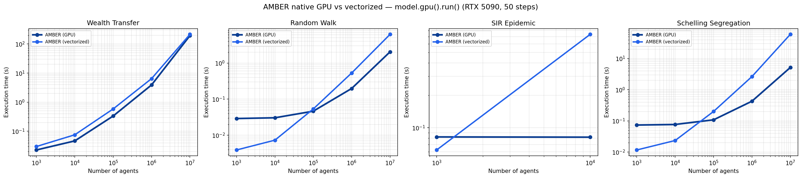

Benchmarks & Performance
========================

AMBER stores the whole population as a columnar Polars DataFrame and compiles
each step into a handful of vectorized expressions, so per-step cost stays
near-constant in the number of agents. This page summarises how that plays out
against other agent-based-modelling frameworks. The full, reproducible suite —
correctness checks, raw timings, and per-model speedups — lives under
``benchmarks/`` (see ``benchmarks/README.md``); reproduce the headline numbers
with ``python benchmarks/run_all_frameworks.py``.

Headline (5,000 agents)
-----------------------

At 5,000 agents over 50 steps, **AMBER (vectorized) is the fastest Python-hosted
framework** on the wealth-transfer and random-walk workloads, and competitive on
SIR. Against ``Agents.jl`` (Julia, compiled dispatch) AMBER trails on the two
cheapest per-step kernels, where fixed overhead dominates. Every framework is
checked against output invariants (wealth conservation, boundary clamping,
S+I+R conservation) **before** timing.

Scaling to 10M agents with the GPU backend
------------------------------------------

From **0.4.3**, the product API for a single large run is the same vectorized
``Model`` + view-API ``step`` under ``model.gpu().run()`` (:doc:`api/gpu`) —
not a separate kernel rewrite. The main harness times that path in
``benchmarks/run_all_frameworks.py``. Batched calibration is separate
(:doc:`api/gpu_ensemble`).

**Native GPU vs vectorized (NVIDIA RTX 5090, 50 steps, 10 runs, trimmed mean).**
Same model classes on both devices — GPU via ``model.gpu().run()``. Full table:
``benchmarks/results/summary_table_native_gpu.md``.

================  ==========  =======  =======  =======  =======  =======
Model             Device      1k       10k      100k     1M       10M
================  ==========  =======  =======  =======  =======  =======
Wealth transfer   GPU         23 ms    47 ms    334 ms   3.91 s   193 s
                  vectorized  30 ms    76 ms    585 ms   6.44 s   214 s
Random walk       GPU         29 ms    31 ms    47 ms    198 ms   2.04 s
                  vectorized  3.9 ms   7.3 ms   54 ms    531 ms   6.23 s
Schelling         GPU         74 ms    77 ms    108 ms   428 ms   5.17 s
                  vectorized  12 ms    24 ms    201 ms   2.64 s   59.8 s
SIR (all-pairs)   GPU         82 ms    82 ms    —        —        —
                  vectorized  62 ms    736 ms   —        —        —
================  ==========  =======  =======  =======  =======  =======

- **Where GPU helps:** random walk (~2.7× at 1M, ~3× at 10M) and Schelling
  (~6× at 1M, ~12× at 10M). Wealth stays close — light kernels pay device
  overhead.
- **SIR:** all-pairs contact matrix OOMs above 10k on this host; not a large-N
  claim for that topology.
- **Reproduce:** on CUDA,
  ``python benchmarks/run_all_frameworks.py --frameworks "AMBER (GPU)" "AMBER (vectorized)"``
  with agents 1k→10M, then replot with
  ``python benchmarks/plot_scaling_with_gpu_schelling.py``.
- **Historical multi-framework chart** (pre–0.4.3 hand-rolled GPU harness on
  RTX 3090): ``benchmarks/results/scaling_chart_gpu_schelling.png`` — qualitative
  only; do not cite its per-point ms as current ``model.gpu().run()`` times.

Calibration throughput
----------------------

For derivative-free calibration, the GPU *ensemble* axis batches ``B``
simulations of ``N`` agents into one device pass (:func:`ambr.gpu_ensemble.smac_batch_calibrate`).
On a well-mixed SIR recovery task, AMBER's GPU batched ensemble reaches the best
held-out validation loss at roughly **270× the slowest framework** and ~3× the
fastest CPU competitor, evaluating ~970 candidate parameter sets per second.
